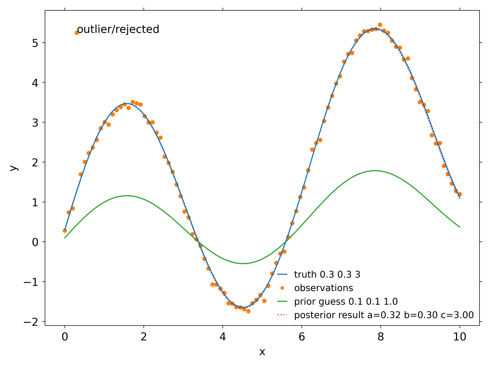

# Ensemble Kalman Square Root Filter

Implementation of the Ensemble Kalman Square Root Filter using BLAS. The algorithm is after [Whitaker and Hamill (2002)](https://journals.ametsoc.org/view/journals/mwre/130/7/1520-0493_2002_130_1913_edawpo_2.0.co_2.xml) and [Peters et al. (2005)](https://agupubs.onlinelibrary.wiley.com/doi/abs/10.1029/2005JD006157). Currently this package is experimental.

## Installation

Installation is not fully automatic yet, and no dependency checks are done

### python api 

Clone the repository and cd into the main directory. Make sure to have a working python + numpy distribution and that meson is installed. Also, make sure that a BLAS library is installed, and that the path to the library is known to your linker (LD_LIBRARY_PATH). Sometimes the blas library has a different name then te one specified in the meson.build. If needed, change the name corresponding to the blas library you want to link to. Using pip will install this as a site-package.

clone the repository and cd into the main directory. Build with
```sh
pip install . 
```
useful flags may be `--break-system-packages` and `--user`. 

### Fortran

Currently, no automatic installation of either a static library nor shared library exist. To include it in a project, copy the source. 

## Usage

### python
A small python example is given in examples, which can also be used as a test.
```sh
cd examples
python example.py
```

It will fit some synthetic data to the following function $y(t)$

$$ y = a\cos(t) + bt + c\sin(t) $$

where $a$, $b$, and $c$ are to be determined. this produces the following figure



Import the package
```python
import pyenkf
```
Call the filter, with arguments as specified below
```python
pyenkf.enkf_core.enksrf(obs, may_reject, rejection_threshold, Hx, HX_prime, X_prime, R, HPHR, x, rejected)
	'''
	Fit K model parameters, refered to as the state x, of a linear model H to N observations using en ensemble kalman filter approach, with M members. The following input parameters are modified in place: Hx, rejected, x, HX_prime, X_prime, HPHR. Make sure that np.arrays are fortran contigious arrays, i.e. their order='F'. 

	Parameters:  
	     obs : ndarray, dtype=float, (N,)
	 	   the observations of 

    	     may_reject : ndarray, dtype=boolean, (N,)
	     		  observations that may be rejected dim N

             rejection_threshold : ndarray, dtype=float, (N,) 

	     Hx : ndarray, dtype=float, (N,) 
	          prior model of dim N

	     HX_prime : ndarray, dtype=float, (N,M,) 
	                ensemble devations from the prior model dim N,M; M = number of ensemble members

	     X_prime :  ndarray, dtype=float, (K,M,) 
			devations dim K,M, K is number of parameters to be fitted

	     R : ndarray, dtype=float, (N,) 
		 observation error

	     HPHR : ndarray, dtype=float, (N,) 

	     x : ndarray, dtype=float, (K,) 
	'''
```
It is important to specify arrays to be Fortran-contigious for N-dim arrays if N>1, so the memory layout is compatible with the Fortran routine used, this can be done as follows: 

```python
some_variables=np.array([[1,2],[2,3],order='F',dtype=float)
some_zeros_int=np.zeros((10,10),order='F',dtype=int)
# check the flags: 
print(some_variables.flags)
print(some_zeros_int.flags)
```
